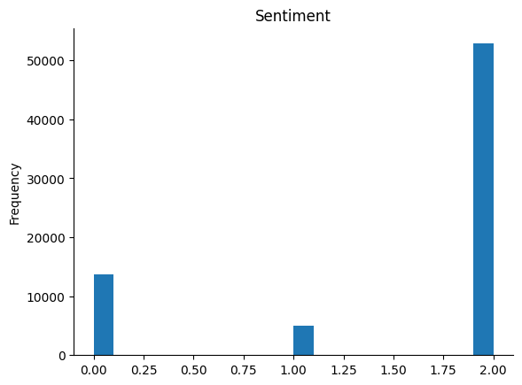
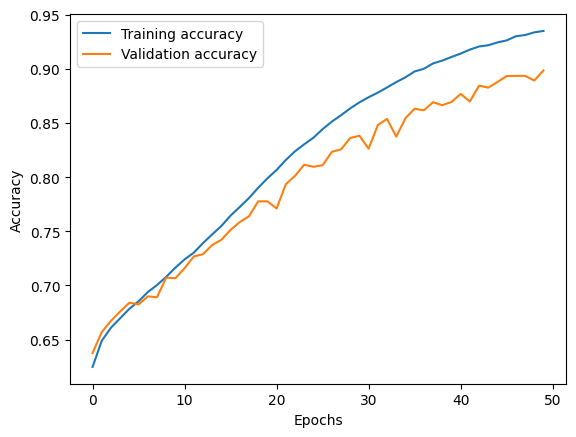
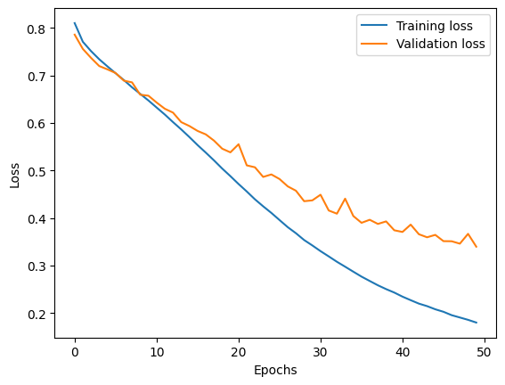

# Sentiment Analysis of Amazon'23 Megazine Subscription dataset

This is an End-to-end machine learning project that uses the publicly available **Amazon'23** Megazine Subscriptions dataset to perform sentiment analysis. The dataset consists of `71,497` reviews and the corresponding numerical ratings.

## Dataset

Class distribution of the dataset is given by the following table:

| Sentiment | Number of entries |
| :-----: | :-----: |
| Positive | 52826 |
| Neutral | 5033 |
| Negative | 13638 |

### Bar chart representing class distribution of the dataset

In the above chart:
- 0 represents `Negative`
- 1 represents `Neutral`
- 2 represents `Positive`

Dataset Link: https://amazon-reviews-2023.github.io/

## Data Preprocessing

The dataset undergoes preprocessing to prepare it for the next steps. Preprocessing steps performed are:

1. Lowercasing
2. Whitespace stripping
3. Removal of links
4. Removal of brackets
5. Removal of html tags
6. Removal of digits
7. Removal of punctuation
8. Removal of multiple spaces
9. Lemmatization

## GloVe Word Embeddings
GloVe stands for Global Vectors for Word Representation. It is an unsupervised learning algorithm for generating word embeddings, which are vector representations of words in a continuous space. It was developed by researchers at Stanford and is based on aggregating global word-word co-occurrence statistics from a large corpus.

In this project, **6B.100d** GloVe embeddings are utilized to convert text data into vector representations, which are then fed into the machine learning model. The embeddings help capture the semantic meaning of the text and improve the model's ability to understand the relationships between words.

## Data Resampling

The dataset is highly imbalanced with almost **74%** of the entries belonging to the **Positive** sentiment category whereas **7%** and **19%** of the data belongs to the categories **Neutral** and **Negative** respectively.

To handle class imbalance, a resampling technique known as **Random Oversampling** is used.

In random oversampling, instances from the minority class are randomly selected and duplicated until the minority class has the same number of instances as the majority class. This effectively balances the class distribution by increasing the size of the minority class.

Class distribution of the dataset after resampling is given by the following table:

| Sentiment | Number of entries |
| :-----: | :-----: |
| Positive | 52826 |
| Neutral | 52826 |
| Negative | 52826 |

## Data Splitting
The dataset was split into **train** and **test** sets with **80%** and **20%** of the data respectively.

## Model

The **Gated Recurrent Unit** variant of Recurrent Neural Network is used in this project.

The model is trained for `50` epochs with `32` batch_size.

The **categorical_crossentropy** loss function is used along with **Adaptive Moment Estimation** optimizer.

Early stopping is used to prevent overfitting that monitors `val_loss` parameter with a patience of `5`. The performance of the model is evaluated in terms of `Accuracy`, `Precision`, `Recall` and `Loss`.

## Results

The results produced by the model are:
| Metric | Obtained Value |
|:---:|:---:|
|Accuracy| 90.33%|
|Precision| 0.9091|
|Recall| 0.8945|
|Loss|0.3367|

### Training and Validation accuracy curve with respect to epochs

### Training and Validation loss curve with respect to epochs

## Deployment

The trained model is deployed using [Streamlit](https://streamlit.io/) in [Streamlit community cloud](https://streamlit.io/cloud) platform.

See the live site [here](https://amazon-megazine-sentiment-analyzer.streamlit.app/).

## Requirements

To run this project, the following dependencies are required:

- Python 3.10.12
- Numpy 1.26.4
- Pandas 2.2.2
- NLTK 3.9.1
- TensorFlow 2.17.0
- Keras 3.5.0
- Scikit-Learn 1.5.1
- Imbalanced-Learn 0.12.3
- GloVe 6B.100d pretrained word embeddings
- Streamlit 1.38.0

&copy; 2024 all rights reserved.